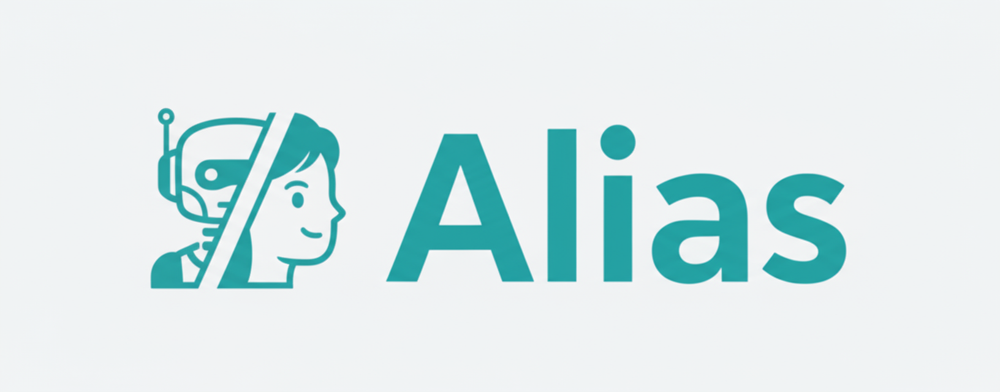

<h1 style="text-decoration: none; border-bottom: none; display: inline; vertical-align: middle; margin: 0;">Alias-Agent: Start It Now, Extend It Your Way, Deploy All with Ease</h1>

    
    
    

*Alias-Agent* (short for *Alias*) is an LLM-empowered agent built on [AgentScope](https://github.com/agentscope-ai/agentscope) and [AgentScope-runtime](https://github.com/agentscope-ai/agentscope-runtime/), designed to serve as a general-purpose intelligent assistant for responding to user queries. Alias excels at decomposing complicated problems, constructing roadmaps, and applying appropriate strategies to tackle diverse real-world tasks.

Alias employs a multi-mode operational mechanism for flexible task execution, including `General`, `Browser Use`, `Deep Research`, `Financial Analysis`, and `Data Science`. When switching between different operational modes, Alias is equipped with tailored instructions, specialized tool sets, and the capability to orchestrate various expert agents. This allows Alias to better adapt to the specific requirements of diverse downstream tasks. For example, when handling financial analysis, Alias employs traceable reasoning chains and generates explainable results to increase user trust in its decision-making, along with optimized report visualizations; When resolving data science tasks, Alias can access user-associated databases and is designed to facilitate efficient data analysis, processing, and prediction.

We aim for Alias to serve as an out-of-the-box solution that users can readily deploy for various tasks, supported by a comprehensive pipeline for agent development, testing, and deployment based on the AgentScope ecosystem. Beyond being a ready-to-use agent, we also envision Alias as a foundational template that can be adapted for diverse scenarios. Developers are encouraged to extend and customize Alias at the tool, prompt, and agent levels to meet specific requirements.

We welcome more developers to join the community and contribute to ongoing innovation.

