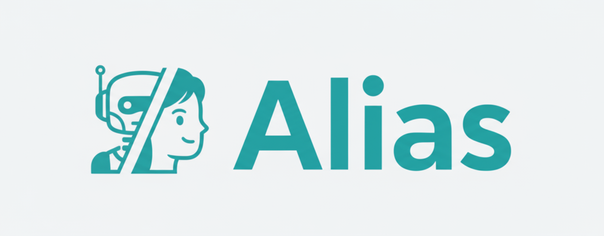

<div align="center">


<h1 style="text-decoration: none; border-bottom: none; display: inline; vertical-align: middle; margin: 0;">Alias-Agent: 即开即用，自由扩展，轻松部署</h1>

</div>

## 项目介绍
*Alias-Agent*（简称 *Alias*）是一个基于 [AgentScope](https://github.com/agentscope-ai/agentscope) 和 [AgentScope-runtime](https://github.com/agentscope-ai/agentscope-runtime/) 构建的LLM驱动的智能体，旨在作为响应用户查询的智能助手。Alias擅长分解复杂问题、构建路线图，并应用适当的策略来处理各种现实世界的任务。

具体而言，Alias提供了三种操作模式，以实现灵活的任务执行：
- **Simple React（简单React模式）**：采用经典的推理-行动循环来迭代解决问题和执行工具调用。
- **Planner-Worker（规划者-工作者模式）**：使用智能规划将复杂任务分解为可管理的子任务，由专门的工作者智能体独立处理每个子任务。
- **Built-in Agents（内置智能体）**：利用针对特定领域定制的专业智能体，包括用于全面分析的*深度研究智能体*和用于基于网络交互的*浏览器使用智能体*。更多详细信息可参考下面的"基本使用"部分。

我们的目标是让Alias成为一个开箱即用的解决方案，用户可以随时部署以处理各种任务。

## 即将推出

除了作为现成的智能体，我们还设想Alias作为一个基础模板，可以迁移适配到不同的场景。开发者可以在工具、提示词和智能体级别扩展和自定义Alias，以满足他们的特定需求。

我们正在积极开发以下领域的专业增强和适配：
- **商业智能（BI）** 场景
- **金融**分析应用
- **问答（QA）** 系统

敬请期待即将发布的版本！


## 安装

以开发模式安装Alias包：

```bash
pip install -e .

# 设置沙箱环境
# 如果您使用的是colima，则需要运行以下命令
# export DOCKER_HOST=unix://$HOME/.colima/default/docker.sock
# 更多详细信息可参考 https://runtime.agentscope.io/en/sandbox.html

# 方式1：从registry拉取
export RUNTIME_SANDBOX_REGISTRY=agentscope-registry.ap-southeast-1.cr.aliyuncs.com
docker pull agentscope-registry.ap-southeast-1.cr.aliyuncs.com/agentscope/runtime-sandbox-alias:latest

# 方式2：从docker hub拉取
docker pull agentscope/runtime-sandbox-alias:latest
```

这将安装 `alias` 命令行工具。

## 基本使用

`alias` CLI提供了一个终端界面来运行AI智能体以处理各种任务。

### 运行命令

首先，设置API密钥：
```bash
# 模型API密钥
export DASHSCOPE_API_KEY=your_dashscope_api_key_here

# 使用其他模型：前往 src/alias/agent/run.py，将您的模型添加到 MODEL_FORMATTER_MAPPING，然后运行bash来设置您的模型和API密钥。例如：
#export MODEL=gpt-5
#export OPENAI_API_KEY=your_openai_api_key_here

# 搜索API密钥（深度研究所需）
export TAVILY_API_KEY=your_tavily_api_key_here
```

执行智能体任务：

```bash
alias_agent run --task "Your task description here"
```

### 示例

#### 使用所有智能体运行（元规划者与工作者）：
```bash
alias_agent run --task "Analyze Meta stock performance in Q1 2025"
```

#### 仅使用Browser-use Agent运行：

```bash
alias_agent run --mode browser --task "Search five latest research papers about browser-use agent"
```

#### 上传文件到沙箱工作区：
```bash
# 上传单个文件
alias_agent run --task "Analyze this data" --files data.csv

# 上传多个文件
alias_agent run --task "Process these files and create a summary report" --files report.txt data.csv notes.md

# 使用简短形式 (-f)
alias_agent run --task "Review the documents" -f document1.pdf document2.txt

# 与其他选项结合使用
alias_agent run --mode all --task "Analyze the data and generate insights" --files dataset.csv --verbose
```

**注意**：使用 `--files` 上传的文件会自动复制到沙箱中的 `/workspace` 目录，并保留其原始文件名，使其立即可供智能体访问。

### 获取智能体生成的文件
在您运行 `alias_agent` 的目录中，您应该会找到一个 `sessions_mount_dir` 目录，其中包含子目录，每个子目录都包含来自沙箱挂载文件系统的 `/workspace` 的内容。所有生成的文件都应位于该处。

