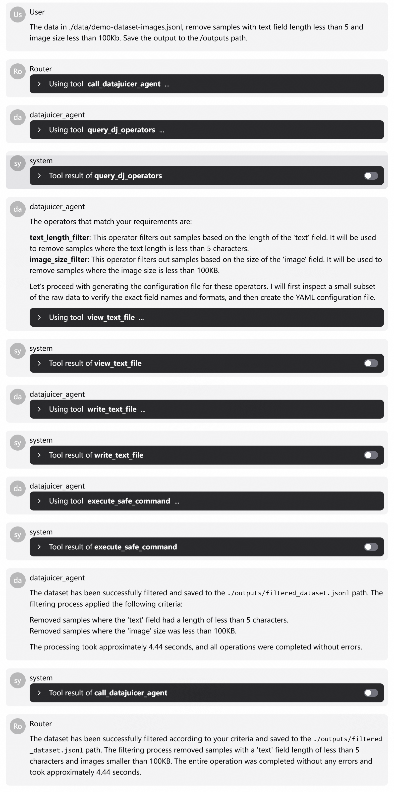

# DataJuicer Agent

A multi-agent data processing system built on [AgentScope](https://github.com/modelscope/agentscope) and [Data-Juicer (DJ)](https://github.com/modelscope/data-juicer). This project demonstrates how to leverage the natural language understanding capabilities of large language models, enabling non-expert users to easily harness the powerful data processing capabilities of Data-Juicer.

## 📋 Table of Contents

- [DataJuicer Agent](#datajuicer-agent)
  - [📋 Table of Contents](#-table-of-contents)
  - [What Does This Agent Do?](#what-does-this-agent-do)
  - [Architecture](#architecture)
  - [Quick Start](#quick-start)
    - [System Requirements](#system-requirements)
    - [Installation](#installation)
    - [Configuration](#configuration)
    - [Usage](#usage)
  - [Agent Introduction](#agent-introduction)
    - [Data Processing Agent](#data-processing-agent)
    - [Code Development Agent (DJ Dev Agent)](#code-development-agent-dj-dev-agent)
  - [Advanced Features](#advanced-features)
    - [Operator Retrieval](#operator-retrieval)
      - [Retrieval Modes](#retrieval-modes)
      - [Usage](#usage-1)
    - [MCP Agent](#mcp-agent)
      - [MCP Server Types](#mcp-server-types)
      - [Configuration](#configuration-1)
      - [Usage Methods](#usage-methods)
  - [Feature Preview](#feature-preview)
    - [Data-Juicer Q\&A Agent (Demo Available)](#data-juicer-qa-agent-demo-available)
    - [Data Analysis and Visualization Agent (In Development)](#data-analysis-and-visualization-agent-in-development)
  - [Troubleshooting](#troubleshooting)
    - [Common Issues](#common-issues)
    - [Optimization Recommendations](#optimization-recommendations)

## What Does This Agent Do?

Data-Juicer (DJ) is a one-stop system for text and multimodal data processing for large language models. It provides nearly 200 core data processing operators, covering multimodal data such as text, images, and videos, and supports the full pipeline of data analysis, cleaning, and synthesis.

After running this example, you can:
- **Intelligent Query**: Find suitable operators from nearly 200 data processing operators for your data scenarios
- **Automated Pipeline**: Describe your data processing needs, automatically generate Data-Juicer YAML configurations and execute them
- **Custom Extension**: Quickly develop custom operators for specific scenarios

## Architecture

```
User Query
    ↓
Router Agent ──┐
               ├── Data Processing Agent (DJ Agent)
               |   ├── General File Read/Write Tools
               │   ├── query_dj_operators (Query DataJuicer operators)
               │   └── execute_safe_command (Execute safe commands including dj-process, dj-analyze)
               │
               └── Code Development Agent (DJ Dev Agent)
                   ├── General File Read/Write Tools
                   ├── get_basic_files (Get basic development knowledge)
                   ├── get_operator_example (Get operator source code examples related to requirements)
                   └── configure_data_juicer_path (Configure DataJuicer path)
```

## Quick Start

### System Requirements

- Python 3.8+
- Valid DashScope API key
- Optional: Data-Juicer source code (for custom operator development)

### Installation

```bash
# Recommended to use uv
uv pip install -r requirements.txt
```

or

```bash
pip install -r requirements.txt
```

### Configuration

1. **Set API Key**

```bash
export DASHSCOPE_API_KEY="your-dashscope-key"
```

2. **Optional: Configure Data-Juicer Path (for custom operator development)**

```bash
export DATA_JUICER_PATH="your-data-juicer-path"
```

> **Tip**: You can also set this during runtime through conversation, for example:
> - "Help me set the DataJuicer path: /path/to/data-juicer"
> - "Help me update the DataJuicer path: /path/to/data-juicer"

### Usage

Choose the running mode using the `-u` or `--use_studio` parameter:

```bash
# Use AgentScope Studio (provides interactive interface)
python main.py --use_studio true

# Or use command-line mode (default)
python main.py
```

## Agent Introduction

### Data Processing Agent

Responsible for interacting with Data-Juicer and executing actual data processing tasks. Supports automatic operator recommendation from natural language descriptions, configuration generation, and execution.

**Typical Use Cases:**
- **Data Cleaning**: Deduplication, removal of low-quality samples, format standardization
- **Multimodal Processing**: Process text, image, and video data simultaneously
- **Batch Conversion**: Format conversion, data augmentation, feature extraction

<details>
<summary>View Complete Example Log (from AgentScope Studio)</summary>

</details>

### Code Development Agent (DJ Dev Agent)

Assists in developing custom data processing operators, powered by the `qwen3-coder-480b-a35b-instruct` model by default.

**Typical Use Cases:**
- **Develop domain-specific filter or transformation operators**
- **Integrate proprietary data processing logic**
- **Extend Data-Juicer capabilities for specific scenarios**

<details>
<summary>View Complete Example Log (from AgentScope Studio)</summary>

</details>

## Advanced Features

### Operator Retrieval

DJ Agent implements an intelligent operator retrieval tool that quickly finds the most relevant operators from Data-Juicer's nearly 200 operators through an independent LLM query process. This is a key component enabling the data processing agent and code development agent to run accurately.

We provide three retrieval modes to choose from based on different scenarios:

#### Retrieval Modes

**LLM Retrieval (default)**
- Uses the Qwen-Turbo model to match the most relevant operators
- Provides detailed matching reasons and relevance scores
- Suitable for scenarios requiring high-precision matching, but consumes more tokens

**Vector Retrieval (vector)**
- Based on DashScope text embedding and FAISS similarity search
- Fast and efficient, suitable for large-scale retrieval scenarios

**Auto Mode (auto)**
- Prioritizes LLM retrieval, automatically falls back to vector retrieval on failure

#### Usage

Specify the retrieval mode using the `-r` or `--retrieve_mode` parameter:

```bash
python main.py --retrieve_mode vector
```

For more parameter descriptions, see `python main.py --help`

### MCP Agent

Data-Juicer provides MCP (Model Context Protocol) services that can directly obtain operator information and execute data processing through native interfaces, making it easy to migrate and integrate without separate LLM queries and command-line calls.

#### MCP Server Types

Data-Juicer provides two MCP server modes:

**Recipe-Flow (Data Recipe)**
- Filter by operator type and tags
- Support combining multiple operators into data recipes for execution
  
**Granular-Operators (Fine-grained Operators)**
- Provide each operator as an independent tool
- Flexibly specify operator lists through environment variables
- Build fully customized data processing pipelines

For detailed information, please refer to: [Data-Juicer MCP Service Documentation](https://modelscope.github.io/data-juicer/en/main/docs/DJ_service.html#mcp-server)

> **Note**: The Data-Juicer MCP server is currently in early development, and features and tools may change with ongoing development.

#### Configuration

Configure the service address in `configs/mcp_config.json`:

```json
{
    "mcpServers": {
        "DJ_recipe_flow": {
            "url": "http://127.0.0.1:8080/sse"
        }
    }
}
```

#### Usage Methods

Enable MCP Agent to replace DJ Agent:

```bash
# Enable MCP Agent and Dev Agent
python main.py --available_agents [dj_mcp, dj_dev]

# Or use shorthand
python main.py -a [dj_mcp, dj_dev]
```

## Feature Preview

The Data-Juicer agent ecosystem is rapidly expanding. Here are the new agents currently in development or planned:

### Data-Juicer Q&A Agent (Demo Available)

Provides users with detailed answers about Data-Juicer operators, concepts, and best practices.

<video controls width="100%" height="auto" playsinline>
    <source src="https://github.com/user-attachments/assets/a8392691-81cf-4a25-94da-967dcf92c685" type="video/mp4">
    Your browser does not support the video tag.
</video>

### Data Analysis and Visualization Agent (In Development)

Generates data analysis and visualization results, expected to be released soon.

## Troubleshooting

### Common Issues

**Q: How to get DashScope API key?**
A: Visit [DashScope official website](https://dashscope.aliyun.com/) to register an account and apply for an API key.

**Q: Why does operator retrieval fail?**
A: Please check network connection and API key configuration, or try switching to vector retrieval mode.

**Q: How to debug custom operators?**
A: Ensure Data-Juicer path is configured correctly and check the example code provided by the code development agent.

**Q: What to do if MCP service connection fails?**
A: Check if the MCP server is running and confirm the URL address in the configuration file is correct.

### Optimization Recommendations

- For large-scale data processing, it is recommended to use DataJuicer's distributed mode
- Set batch size appropriately to balance memory usage and processing speed
- For more advanced data processing features (synthesis, Data-Model Co-Development), please refer to DataJuicer [documentation](https://modelscope.github.io/data-juicer/en/main/index.html)

---

**Contributing**: Welcome to submit Issues and Pull Requests to improve AgentScope, DataJuicer Agent, and [DataJuicer](https://modelscope.github.io/data-juicer/en/main/index.html#contribution-and-acknowledgements). If you encounter problems during use or have feature suggestions, please feel free to contact us.