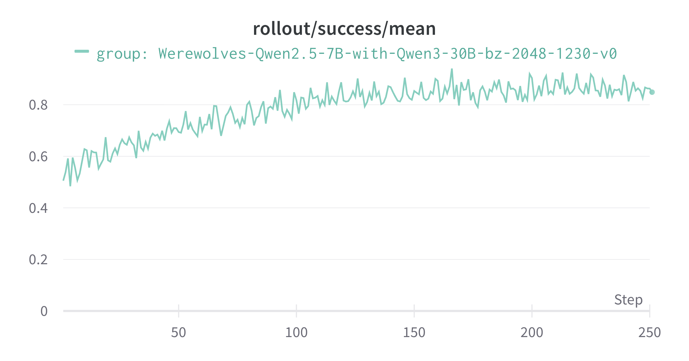

# Training Werewolf Game with RL using AgentScope-Tuner

This project demonstrates training werewolf game agents using Reinforcement Learning (RL) with the AgentScope tuner framework (AS-Tune). We employ the multi-step Group Relative Policy Optimization (GRPO) algorithm to train werewolf players to develop sophisticated strategies and improve their win rate from ~50% to ~85%.

## Overview

The werewolf game is a complex social deduction game that requires strategic thinking, deception, and multi-agent collaboration. In this project, we train AI agents to play as werewolves in a 7-player game setting, where they must eliminate all villagers while hiding their identity. Through reinforcement learning, the trained werewolf agents learn to:

- Avoid revealing their identity in public discussions
- Coordinate with teammates effectively
- Develop advanced strategies like "deep cover" tactics
- Deceive villagers and mislead investigations

## Task Setting

### Training Objective

The goal is to train **werewolf players** to maximize their team's win rate against other roles (villagers, seer, and witch). The reward function is defined by rule:
- **Reward = +1.0** if werewolves win (all villagers eliminated)
- **Reward = 0.0** if villagers win (all werewolves eliminated)
- **Reward = -0.1** for game execution errors (penalty to discourage invalid behaviors)

### Game Configuration

This implementation is based on the `games/game_werewolves` example but with several key modifications:

Original 9-Player Setup:
- 3 Werewolves, 3 Villagers, 1 Seer, 1 Witch, 1 Hunter
- Witch cannot self-rescue (use healing potion on herself)

Modified 7-Player Setup (This Project):
- 2 Werewolves: Kill one player each night, must hide identity during the day
- 3 Villagers: Ordinary players without special abilities
- 1 Seer: Can check one player's identity each night
- 1 Witch: Has two one-time-use potions:
  - Healing potion: Save a player from being killed at night (**can self-rescue**)
  - Poison potion: Eliminate one player at night

We also make slight modification to the prompt, and ask the players to reasoning before they speak publicly.

### Models

- **Trainable Model (Werewolf Players)**: `Qwen/Qwen2.5-7B-Instruct`
- **Auxiliary Model (Other Roles)**: `Qwen/Qwen3-30B-A3B-Instruct-2507`

### Algorithm

**Multi-Step GRPO (Group Relative Policy Optimization)**
- Group size: 32 rollouts per training batch
- Batch size: 24
- Learning rate: 1e-6
- Advantage normalization by episode length
- Clipping range: [0.2, 0.28]
- No KL penalty (kl_coef: 0)

## Dataset Preparation

The dataset for this task is minimal and consists only of random **seeds** for role shuffling. Each training episode uses a different seed to randomize player role assignments, ensuring diverse training scenarios.

**Dataset Location**: `data/train.jsonl`

**Format**:
```json
{"seed": 0}
{"seed": 1}
{"seed": 2}
...
```

The dataset contains seeds from 0 to 159 (160 total seeds). During training, these seeds are used to shuffle role assignments via `np.random.shuffle()`, creating varied game configurations.

## Code Implementation

### High-Level Workflow

The training workflow consists of the following key components:

#### 1. Agent Workflow (`run_werewolves_workflow`)

```python
async def run_werewolves_workflow(task, model, auxiliary_models):
    # 1. Initialize roles
    roles = ["werewolf"] * 2 + ["villager"] * 3 + ["seer", "witch"]
    
    # 2. Shuffle based on task seed
    np.random.seed(task["seed"])
    np.random.shuffle(roles)
    
    # 3. Create agents: werewolves use trainable model, others use auxiliary model
    players = [
        ReActAgent(
            name=f"Player{i+1}",
            model=model if role == "werewolf" else participant_model,
            ...
        ) for i, role in enumerate(roles)
    ]
    
    # 4. Run the game
    good_guy_win = await werewolves_game(players, roles)
    
    # 5. Compute reward
    reward = 1.0 if not good_guy_win else 0.0
    
    return WorkflowOutput(reward=reward, metrics={...})
```

#### 2. Game Loop (`werewolves_game`)

Each game consists of alternating night and day phases:

**Night Phase:**
1. **Werewolves' Turn**: Discuss privately and vote to kill a player
2. **Witch's Turn**: Decide whether to use healing/poison potions
3. **Seer's Turn**: Check one player's identity

**Day Phase:**
1. **Announcement**: Moderator announces who died during the night
2. **Discussion**: All alive players discuss with reasoning/statement separation
3. **Voting**: All players vote to eliminate one suspected werewolf
4. **Last Words**: Eliminated player gives final statement

The game continues until:
- All werewolves are eliminated (villagers win), or
- Werewolves equal or outnumber other players (werewolves win)

#### 3. Reward Calculation

The reward is computed based on the game outcome from the perspective of werewolves:

```python
if not good_guy_win:  # Werewolves win
    reward = 1.0
else:                 # Villagers win
    reward = 0.0
```

## How to Run

### Prerequisites

1. Install AgentScope with tuner support:
```bash
pip install agentscope[full]
```

2. Set up environment variables (optional, can be configured in code):
```bash
export TRINITY_MODEL_PATH="Qwen/Qwen2.5-7B-Instruct"
export TRINITY_AUXILIARY_MODEL_PATH="Qwen/Qwen3-30B-A3B-Instruct-2507"
export TRINITY_CHECKPOINT_ROOT_DIR="./checkpoints"
```

### Configuration

The project uses a hybrid configuration approach:

1. **High-level parameters** in `main.py`:
   - Model paths
   - Dataset configuration
   - Algorithm parameters (group_size, batch_size, learning_rate)

2. **Detailed infrastructure settings** in `config.yaml`:
   - Cluster configuration (nodes, GPUs)
   - Explorer settings (rollout engines, timeouts)
   - Trainer settings (gradient clipping, batch sizes)
   - Monitor configuration (WandB integration)

Key parameters to adjust:

```python
# In main.py
trained_model_path = "Qwen/Qwen2.5-7B-Instruct"
auxiliary_model_path = "Qwen/Qwen3-30B-A3B-Instruct-2507"

dataset = Dataset(
    path="data",
    split="train",
    total_steps=400,  # Total training steps
)

algorithm = Algorithm(
    algorithm_type="multi_step_grpo",
    group_size=32,    # Rollouts per batch
    batch_size=24,    # Training batches per step
    learning_rate=1e-6,
    save_interval_steps=100,
    eval_interval_steps=100,
)
```

### Training Command

First, start your ray cluster.

Then, run the training script:

```bash
cd /path/to/agentscope-samples/training/werewolf_game
python main.py
```

For distributed training, ensure Ray cluster is properly configured in `config.yaml`, make sure that the node number and gpu number matches:

```yaml
cluster:
  node_num: 4
  gpu_per_node: 8
```

## Results

### Quantitative Results

Training on the 7-player werewolf game for 400 steps demonstrates significant improvement:

| Metric | Before Training | After Training (Step 200+) |
|--------|----------------|---------------------------|
| Werewolf Win Rate | ~50% (random baseline) | ~85% |
| Success Rate | 0.50 | 0.85 |

**Reward Curve:**



As shown in the reward curve above, the werewolf win rate steadily increases during training:
- **Steps 0-50**: Win rate fluctuates around 50-60% as the model explores strategies
- **Steps 50-200**: Win rate climbs to 70-80% as effective strategies emerge
- **Steps 200-250**: Win rate stabilizes around 85%

### Qualitative Results

#### Before Training: Critical Mistakes

Untrained models (Qwen2.5-7B-Instruct) make fundamental errors:
- **Self-exposure**: Werewolves accidentally reveal identity in public ("as a werewolf, I think...")
- **Exposing teammates**: When voted out, werewolves point to teammates in last words
- **Random strategy**: No coordination, no threat prioritization (e.g., ignoring the Seer)

#### After Training: "Deep Cover" Werewolf Strategy

After 200+ steps, the trained model **converges to a sophisticated "deep cover" tactic**.
Below is a example where werewolves sacrifice teammates to gain trust, then dominate late game.

**Concrete Example:**

**Setup (Day 1):** Seer publicly identifies Player5 as werewolf. Witch and villagers join the accusation. Player5 (werewolf) is doomed.

**Player4 (werewolf teammate) responds strategically:**

**In short:** Player4 sacrifices teammate to gain trust, pretending to be a logical villager.

**Detailed reasoning and statement:**

*Private Reasoning (only Player4 sees):*
```
"I'm a werewolf, and I know Player2 was targeted last night but survived. 
My teammate Player5 is doomed - Player3 and Player7 are attacking him together. 
I need to deflect suspicion from MYSELF, not save Player5. 

Strategy: Sacrifice Player5 to gain trust. If I vote against my teammate, 
villagers will think I'm trustworthy. This creates confusion and positions 
me as a "confirmed good guy" for later rounds."
```

*Public Statement (all players see):*
```
✅ "I think Player5 is acting very strangely. He brought up Player2 being targeted, 
but didn't explain why he's so focused on them. It feels like a distraction tactic. 
I also noticed that Player3 and Player7 are both accusing Player5, which makes sense - 
their logic is solid. I think we should seriously consider voting out Player5 - 
he's the most suspicious person right now."
```

**Result:** Player5 eliminated, but Player4 gains complete trust from Seer and all villagers.

**Why it works:** 
- Seer trusts Player4 as strong villager ally → won't check him
- Villagers follow Player4's "logical" analysis
- Player4 systematically misleads discussions in later rounds
- Survives to final 2 players → **werewolves win**

This demonstrates the essence of trained behavior: **sacrifice pieces strategically to secure ultimate victory**. The model learns that short-term teammate loss is worthwhile for establishing deep cover and long-term dominance.


